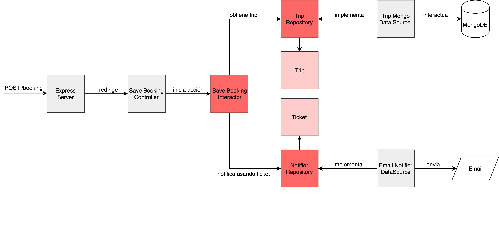

# Hexagonal Architecture with NodeJS and TypeScript - Ticketing System
Sample code used during GeeksHubs online meetup talk 23/04/2020.

Simple ticketing system using concepts of Hexagonal Architecture and leveraging separation of concerns.

The code is divided in two main layers:

Core

- Entities: Business Objects
- Repositories: Interfaces to interact with the entities
- Interactors: Business logic, actions that the system can perform.

Inputs and Outputs

- DataSources: Outputs of our system implementing Repositories and connected to storage systems.
- Controllers: Inputs of our system encapsulating the transport layer. They should trigger the Interactors.

*Note: The purpose of this code is to be used as a guide to explore hexagonal architecture and it is not supposed to run in production.*
## Getting started
- Clone the repo
`git clone https://github.com/samuanv/hexagonal-architecture.git`

- Install dependencies
`npm install`

- Run mongo and mongoclient
`docker-compose up`

- Add the data located in /mongo to a database called `ticketing`

- Start typescript server + nodemon
`npm run watch`
